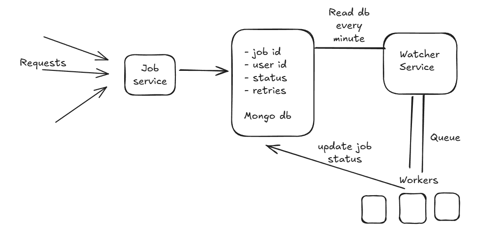

# JOB SCHEDULAR

#### This project focuses on Job Scheduling System coupled Admin Panel that distributes Job Scheduling with support of Fault Tolerance.

## Table of Contents

- [Project Features](#project-features)
- [Tech Stack](#tech-stack)
- [Libraries Used](#libraries-used)
- [Setup and Installation](#setup-and-installation)
- [Environment Variables](#environment-variables)
- [API Endpoints and Sample Requests](#api-endpoints-and-sample-requests)
- [Development Choices](#development-choices)
- [Deployment](#deployment)
- [Acknowledgements](#acknowledgements)
- [Answers for the Assignment](#answers-for-the-assignment)

---

## Project Features

- **Authentication**: Implement secure user authentication using JWT
- **Create job**: Users can create job of sending email at scheduled time
- **Monitoring**: Support for monitoring to see job status - PENDING, COMPLETED, RUNNING, FAILED. Users and admin can see the jobs status.
- **Email-queuing**: Queue the email and sends it when the user is avaliable

---

## Architecture Diagram



## Tech Stack

- **Backend**: NodeJs, Express, Typescript
- **Database**: MongDB, Redis

---

## Libraries Used

- **dotenv**: Loads environment variables from `.env` file.
- **express**: Fast, minimal web server framework.
- **nodemon**: Automatically restarts server on file changes..
- **typescript**: Used to write TypeScript code.
- **ts-node**: Execute typescript code.
- **jsonwebtoken**: Implement authentication and role based access control
- **nodemailer**: Sending Email via Gmail SMTP
- **bullmq**: Queue the email jobs
- **node-cron**: Read jobs every minute

---

## Setup and Installation

### Prerequisites

- NodeJS
- MongoDB
- Redis

### Environment Variables

- Create `.env` filesas per `.env.example` in schedular-service, watcher-service

### Steps

1. **Clone the Repository**:
   ```bash
   git clone https://github.com/ayushjaiz/job-schedular
   cd job-schedular
   ```
2. **Run the Schedular service:**
   ```bash
   cd schedular-service
   npm install
   npm run build
   npm run start
   ```
3. **Run the Watcher service:**
   ```bash
   cd watcher-service
   npm install
   npm run build
   npm run start
   ```

- Schedular service start running at localhost:3002
- Watcher service start running at localhost:3001

---

## Routes

### Public Routes

| Route          | Method | Description                               |
| -------------- | ------ | ----------------------------------------- |
| /auth/login    | POST   | Authenticates user and returns JWT token. |
| /auth/register | POST   | Registers a new user.                     |
| /auth/logout   | POST   | Logs out the current user.                |

### Protected Routes

- Admin Routes

| Route                      | Method | Description            |
| -------------------------- | ------ | ---------------------- |
| /admin/users/:user-id/role | PATCH  | Update user role       |
| /admin/jobs                | GET    | Monitor all users jobs |

- User Routes

| Route       | Method | Description           |
| ----------- | ------ | --------------------- |
| /users/jobs | POST   | Create a job          |
| /users/jobs | GET    | Monitor the user jobs |

## Development Choices

### Why Node.js?

- Excellent package ecosystem
- Strong async/await support
- Easy deployment options

### Why Typescript?

- Prevent from errors during development phase
- Type security
- Faster code development

### Why MongoDB?

- Flexibility to accomodate changes in schema
- Faster read/write operations
- Easy documentation


### Why Redis?

- BullMq uses Redis for creating job queue

## Tradeoffs

### Mongodb

- Preferred mongo db over sql databases. It is because, acidity is not needed for the architecture.
- mongodb provides better avaliablility. This is useful as I have to read the jobs every minute
- Alteranative that could be used - DynamoDB

### Redis

- Bullmq is supported over redis.
- Bullmq provides inbuilt support to distribute jobs to workers

## Node cron

- It is used to poll mongo db every minute as see there are pending job
- Preferred node-cron as polling db is a lightweight process

---

## Deployment

This project is deployed on render : https://job-schedular.onrender.com

Watcher-service running on: https://job-schedular-1.onrender.com

---

## Acknowledgements

This project was completed with the assistance of various online resources. I utilized the following tools and sources to support the development of this application:

- Google + Stack Overflow - for bugs and documentation of libraries
- MongoDb docs
- Bullmq docs

## Answers for the Assignment

### Three things that I learned from this assignment

- Job queuing
- Code modularity. This repo features code division into routes, controllers and database layer.

### What was the challenging part of the assignment?

- Designing the system overall architecture
